# NGSO Constellation Feasibility for Reliance Jio
## Sample Report: First Constellation Layer versus Reference Constellation

Aalyria Spacetime — 2026-08-24

---

## 1. Introduction

Reliance Jio plans a non-geostationary constellation program and asks three
design questions:

1. What coverage availability does a candidate constellation deliver over
   India, as a function of the coverage grade (k satellites in view) and the
   terminal elevation mask?
2. What is the minimum constellation that meets an availability target over
   India?
3. What capacity does the constellation deliver under a given demand
   distribution, with beam hopping?

This sample report answers the first question for the first constellation
layer and demonstrates the full method on two scenarios:

| Parameter | Scenario A — Jio layer 1 | Scenario B — reference |
|---|---|---|
| Satellites | 200 | 150 |
| Walker pattern | 200/20/1 | 150/10/1 |
| Orbital planes | 20 × 10 satellites | 10 × 15 satellites |
| Altitude | 650 km | 1,157 km |
| Inclination | 48.0° | 53.0° |
| User terminals | 251, uniform on India H3 res-3 cells | 203, global sites |
| Demand | 2 Mbps CIR per terminal, both directions | 2 Mbps CIR per terminal |
| Gateways | 24 | 24 |
| Terminal elevation mask | 25° (65° field of regard) | 25° (65° field of regard) |

The same satellite payload model (antenna patterns, fields of regard, RF
chains, carriers) applies to both scenarios. The scenarios differ only in
constellation geometry and terminal placement.

## 2. Methodology

The analysis runs in Python and uses a live Aalyria Spacetime instance as the
prediction engine. The chain has five steps:

1. **Constellation generation.** Python code generates the Walker orbital
   elements for the selected shape.
2. **NMTS model build.** The Python NMTS builder expands each satellite and
   terminal into its full network model: platform and orbit, antennas with
   fields of regard, transmit and receive chains, carriers, and network
   functions.
3. **Instance population.** The NBI Model API loads the constellation model
   into a dedicated Spacetime instance. User terminal entities carry the
   selected user distribution — here uniform, one terminal per India H3 res-3
   cell. Variable-density user models change only this entity set.
4. **Demand distribution.** The Provisioning API creates one Service Request
   per terminal and direction with the requested data rate — here a uniform
   2 Mbps committed rate. Variable demand-density models change only the
   Service Request parameters.
5. **Prediction and comparison.** Spacetime's Link Predictor computes
   line-of-sight availability toward every terminal. Spacetime's SatSolver
   allocates links and data rates against the demand. A parametric Python
   reference model (Keplerian propagation, spherical-Earth visibility,
   H3 service grid) computes the same quantities independently, and the
   report compares the two side by side.

## 3. Scenario geometry

Constellation shape, plane structure and altitude distribution:

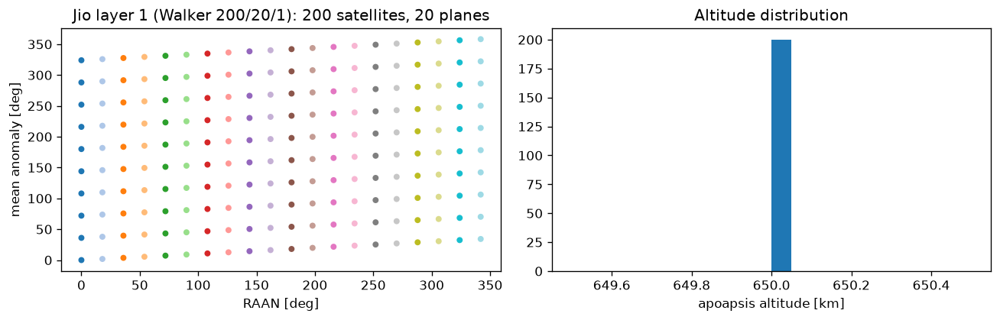

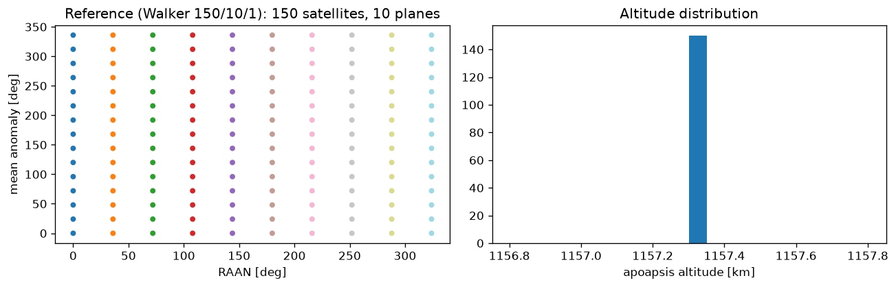

User terminal distributions:

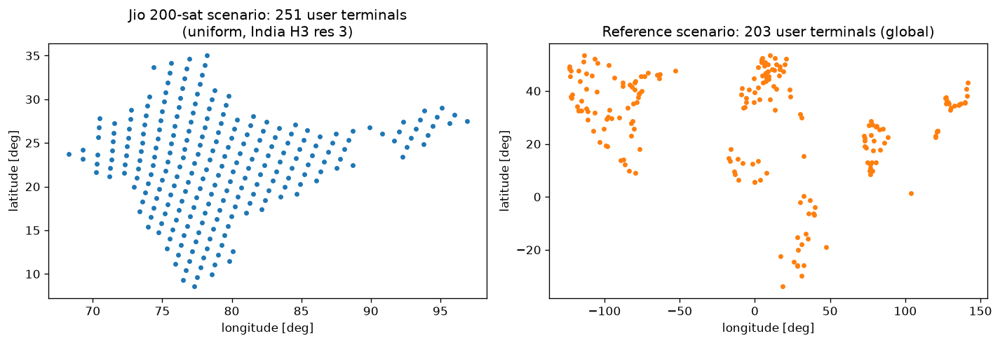

> NetOps screenshots of the loaded constellations and terminal sets can be
> inserted here from the instance UI.

## 4. Coverage results — parametric model

Availability at coverage grade k=1, 25° mask, 110-minute analysis window
(one orbital period plus margin):

| Metric | A — Jio 200 | B — reference 150 |
|---|---|---|
| India: mean k=1 availability | 92.4 % | 99.7 % |
| India: cells at 100 % availability | 17.5 % | 71.3 % |
| India: mean satellites in view | 1.48 | 2.42 |
| Global: mean k=1 availability | 77.9 % | 92.3 % |
| Global: mean satellites in view | 1.45 | 2.56 |

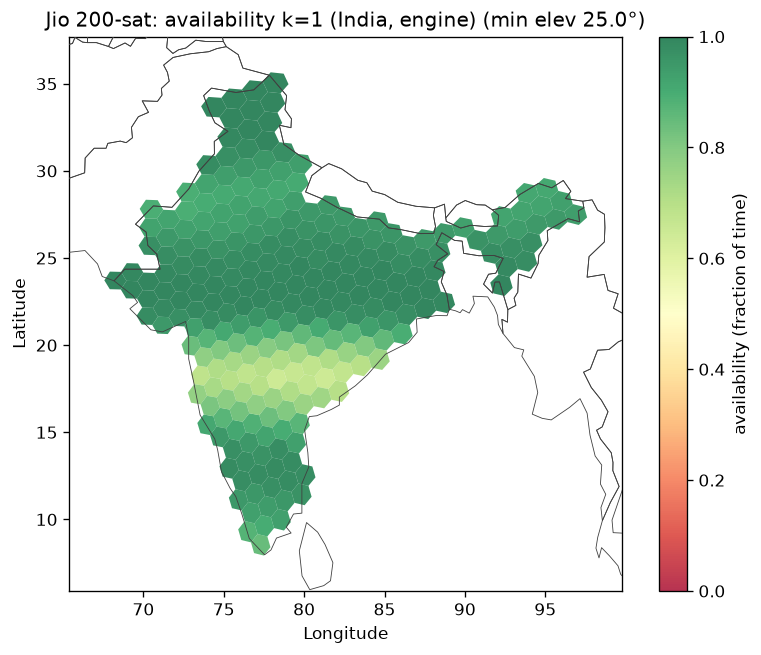

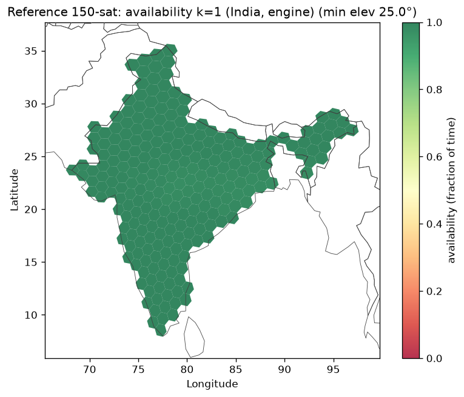

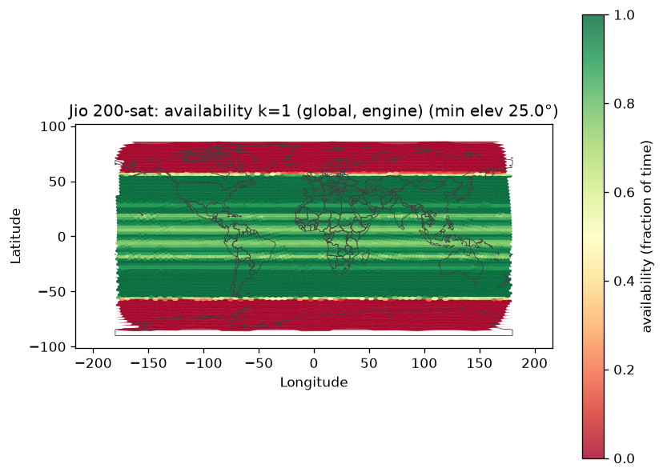

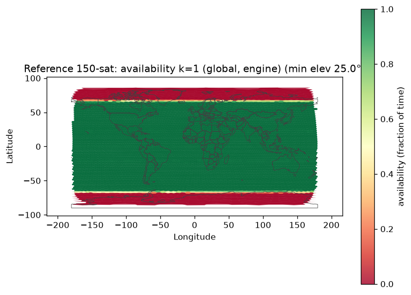

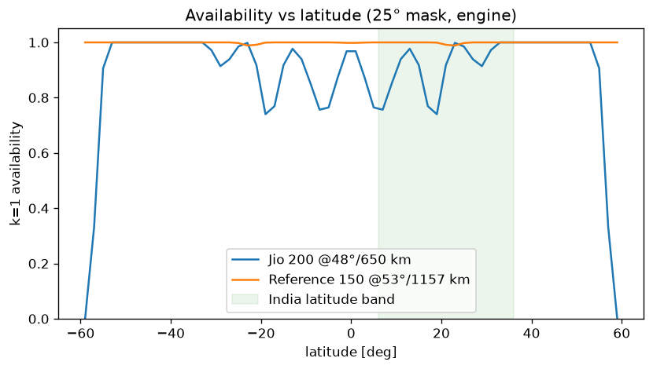

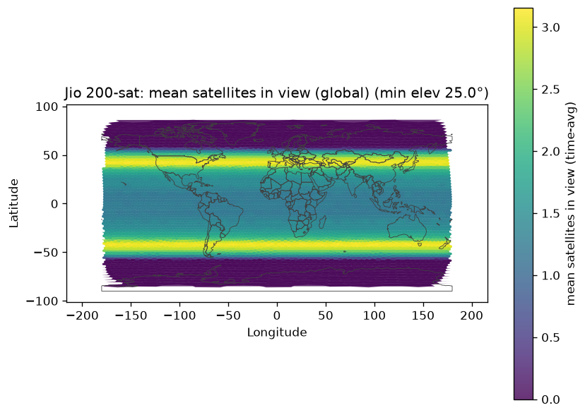

## 5. Spacetime prediction versus parametric model

The Link Predictor output of each instance, aggregated per H3 cell, against
the parametric model evaluated at the same points and times:

| Comparison | Points | Samples | Mean Δ | Max \|Δ\| |
|---|---|---|---|---|
| A — Jio 200 (10° accessibility mask) | 251 | 90 | 0.0000 | 0.0000 |
| B — reference 150 (25° mask) | 211 | 3,000 | −0.0009 | 0.0307 |

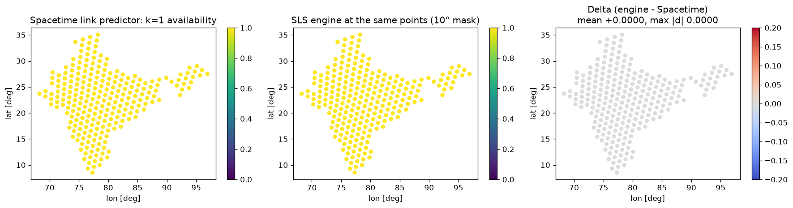

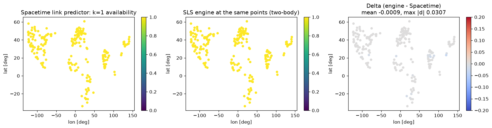

Two masks appear because the two systems draw the line at different layers.
The Link Predictor reports accessibility up to the satellite antenna field of
regard, which corresponds to a 10° elevation limit for Scenario A. The
terminal field of regard (25°) applies at link assignment. The parametric
model reproduces Spacetime exactly at the accessibility layer (Scenario A)
and at the terminal mask (Scenario B). Section 4 reports all coverage at the
25° terminal mask, the service-relevant figure.

## 6. Capacity — SatSolver allocation (reference scenario)

SatSolver allocation against the uniform 2 Mbps demand on the reference
scenario, one snapshot window:

| Metric | Value |
|---|---|
| Service requests | 425 |
| Requests with an allocation | 422 (99.3 %) |
| Aggregate allocated rate | 0.56 Gbps |
| Median allocated rate | 0.5 Mbps of 2 Mbps requested |

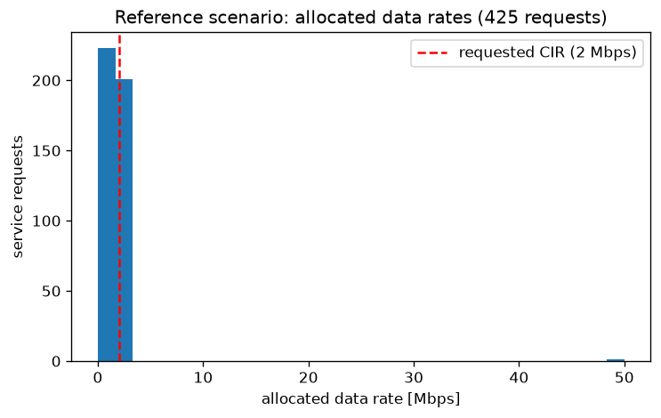

The median allocation sits at one quarter of the requested rate: the 150
satellites time-share their beams across 203 terminals, and the allocation
reflects beam dwell sharing, not link outage. The same measurement applies to
Scenario A in the next report iteration.

## 7. Scenario comparison and observations

| Driver | Effect on availability |
|---|---|
| **Altitude (650 vs 1,157 km)** | The dominant driver. At the 25° mask, one Scenario-B satellite covers a ground circle of ~1,660 km radius; one Scenario-A satellite covers ~1,080 km. Each reference satellite covers ~2.4× the area, so 150 high satellites out-cover 200 low ones (equivalent to ~360 low satellites). |
| **Inclination (48° vs 53°)** | Scenario A concentrates satellite density near 40–48° latitude, north of India (6–36° N). The latitude profile (Section 4) shows Scenario A's availability peak sits poleward of the Indian service band. An inclination near 30–40° would move the density peak into the band for an India-first layer. |
| **Plane structure (20×10 vs 10×15)** | Scenario A's 20 planes give finer longitudinal spacing, which narrows but does not remove the k=1 dips at low latitude. Dips come from the in-plane gap (10 satellites per plane at 650 km leave ~4,000 km along-track spacing against a 2,160 km footprint diameter). |
| **Terminal mask** | At the 10° accessibility mask, Scenario A delivers 100 % availability over India in the measured window. The gap to 92.4 % at 25° is entirely the terminal field-of-regard constraint. The terminal antenna choice is worth as much availability as tens of satellites. |

Summary: the first Jio layer as specified trades altitude for satellite
count and leaves a 7.6 % k=1 availability gap over India at the 25° terminal
mask. Closing the gap without adding satellites has three levers: raise the
altitude, lower the inclination toward the Indian latitude band, or relax
the terminal elevation mask. The full report iteration sweeps these levers
and adds the SatSolver capacity measurement for the Jio layer.

## Annex A — measurement windows

| Dataset | Source | Window |
|---|---|---|
| Scenario A model + Link Predictor output | Dedicated Spacetime instance | 2026-08-20, 3 × 5-minute buckets (90 samples) |
| Scenario B model + Link Predictor output | Reference Spacetime instance | 2026-08-20 06:10–08:10Z, 4 × 5-minute buckets compared (3,000 samples) |
| Scenario B SatSolver allocations | Reference Spacetime instance | 2026-08-20, one snapshot (425 requests) |
| Parametric model runs | Python reference engine | 110 minutes, 30 s step, 2026-08-20 epoch |

Both comparisons use two-body propagation from the model epochs, matching
Spacetime's propagation of NMTS Keplerian elements.
